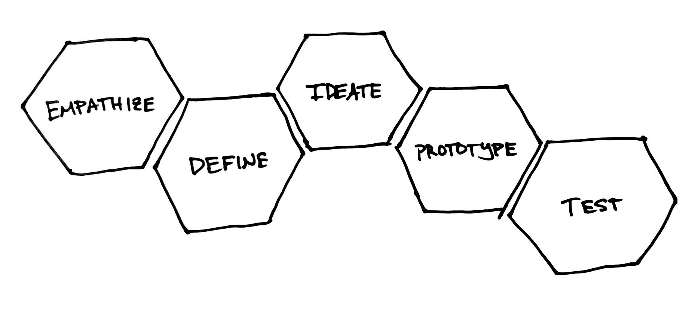

When you set out on a journey it helps to have a map. For this journey, it can’t hurt to pull up the process map for design thinking:

<figure>
  
</figure>

This map originated with IDEO founder David Kelley as a tool when he was building the design program at Stanford called d.school. Some of the vocabulary probably looks familiar. Let’s break it down.

Empathize
: If we want to keep humans at the center of our design process, empathy is a great place to start. Empathy is our ability to relate to and understand others, without necessarily taking on their burdens as our own. If our goal is to design for real people, it’s our job to really understand their needs.

    The best way to do this is to observe and talk to people. As designers, we are curious about what people do, why they do those things, how they expect things they interact with to behave, problems they face, and how their surrounding influence what they do.

Define
: Armed with an understanding of the people we are designing for and their needs, we can set out to define a specific problem we’d like what we’re creating to address. One working description of design could be “creative problem solving” and this is why. Working toward the creation of a product or service, without a clear definition of what we are hoping to accomplish would be very difficult.

    On the other hand, a clearly defined problem provides us with guidance on how to proceed, and something we can check back on as we work to help us stay focused. Once we’ve created something, it also gives us some criteria to determine whether we’ve achieved something purposeful.

Ideate
: Once we know something about whom we're designing for and defined some design goals we can brainstorm. The more clearly defined our goals and audience, the easier it will be to start imagining possible ways to approach the problems. This process should feel very exploratory, reserving judgement for later. We want to think "on paper"—getting ideas out of our heads and mouths, and onto paper and walls.

Prototype
: Based on our potential ideas, we choose some to try out by making a simple version of it. If we make something cheap that simulates our ideas in a way that we can test, it will be easier to try out multiple approaches quickly. This is where design work comes alive in a tangible way.

Test
: Testing our work with people is how we learn from our prototypes. When we test, we find out what parts are working, and which parts are not. Depending on what we discover, we may make a change to our prototype, or go back to the drawing board.

## Further Reading

- [An Introduction to Design Thinking: Process Guide](https://dschool-old.stanford.edu/sandbox/groups/designresources/wiki/36873/attachments/74b3d/ModeGuideBOOTCAMP2010L.pdf) from Stanford's d.school
- [The Double Diamond: Strategy + Execution of the Right Solution](https://www.thoughtworks.com/insights/blog/double-diamond) by Jonny Schneider at Thoughtworks
- For something more in-depth, read [A study of the design process](https://www.designcouncil.org.uk/sites/default/files/asset/document/ElevenLessons_Design_Council%20(2).pdf) from the Design Council in the UK, which resulted in the double diamond model.
